# R-Project 2: Beijing Housing Price Analysis & Hypothesis Testing (R)

This project analyzes **housing prices in Beijing** using R.  
The workflow includes extensive **data cleaning**, **EDA visualizations**, **correlation analysis**, and **hypothesis testing** to understand the key factors influencing house prices.

* **Dataset:** Beijing Housing Price (Kaggle – 318,851 observations, 26 variables)  
* **Tools:** R, tidyverse, ggplot2, corrplot, dplyr  
* **Techniques:** Data cleaning, variable recoding, histograms, correlation analysis, boxplots, scatterplots, t-tests  
* **Goal:** Explore the structure of Beijing’s housing market and validate insights using statistical hypothesis testing.

---

### 📁 Dataset Overview

The dataset contains housing transaction records from Beijing, including:

- Pricing (totalPrice, price per m²)  
- House characteristics (square, rooms, floor, buildingType, structure)  
- Location information (Lng/Lat, district, communityAverage)  
- Accessibility indicators (elevator, subway)

  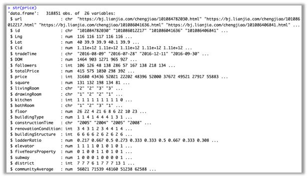
  
<em>Dataset structure overview.</em>

---

### 🧹 Data Cleaning & Preparation

From the raw dataset (318,851 rows), the following steps were taken:

#### ✔ Selected Relevant Variables  
(id, tradeTime, totalPrice, price, square, rooms, floor, communityAverage, elevator, subway, buildingType, buildingStructure)

#### ✔ Converted Categorical Variables to Factors  
Based on dataset documentation:

- **buildingType** → Tower, Bungalow, Plate/Tower, Plate  
- **buildingStructure** → Mixed, Brick/Wood, Steel, Concrete, etc.  
- **elevator** → 0/1  
- **subway** → 0/1  

  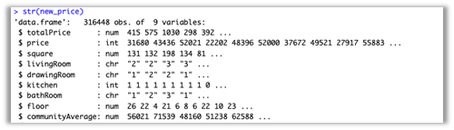
  
<em>Original column types.</em>

  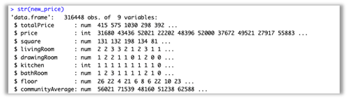
  
<em>Cleaned factor levels.</em>

#### ✔ Removed Missing Values  
2,580 rows containing NA were removed.

  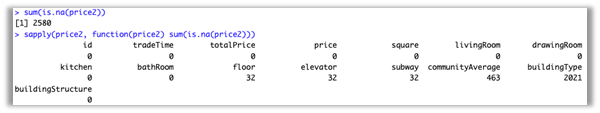
  
<em>NA count before filtering.</em>

#### ✔ Selected Numerical Features for Correlation  
(totalPrice, price, square, rooms, bathRoom, drawingRoom, communityAverage, floor)

  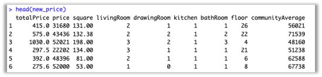
  
<em>Numerical dataset for correlation analysis.</em>

---

### 📊 Exploratory Data Analysis (EDA)

#### 📈 Histograms: Price & Total Price  
Both price per m² and total price show **right-skewed distributions**, with most prices concentrated between 20,000–60,000.

  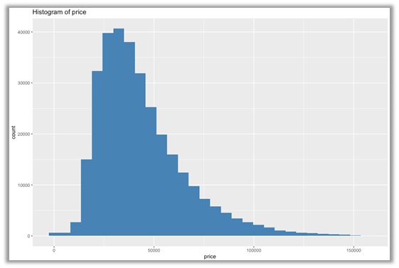
  
<em>Histogram of price per m².</em>

  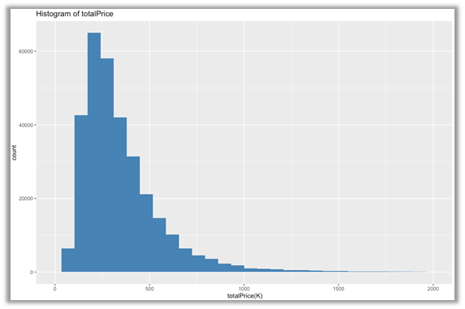
  
<em>Histogram of total price.</em>

---

### 🔗 Correlation Analysis

Strong positive correlations were found among:

- **totalPrice** ↔ price, square, communityAverage  
- **square** ↔ rooms, bathRoom, drawingRoom  

  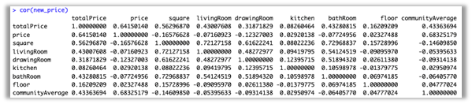
  
<em>Correlation matrix.</em>

  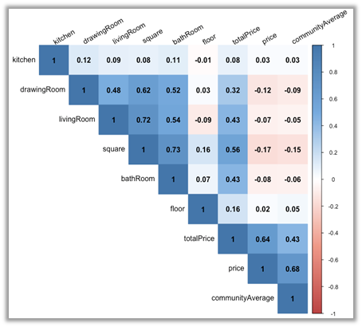
  
<em>Corrplot visualization.</em>

---

### 📦 Boxplots: Price by Categorical Variables

#### Building Type  
🏆 Bungalows are the most expensive building type.

  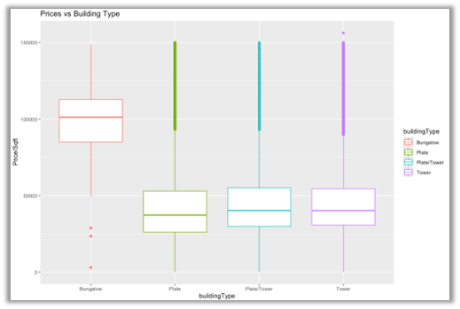
  
<em>Price vs. Building Type.</em>

#### Building Structure  
Steel/Concrete buildings tend to be more expensive.

  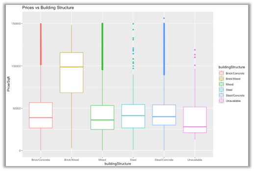
  
<em>Price vs. Building Structure.</em>

#### Elevator  
Homes with elevators → significantly higher prices.

  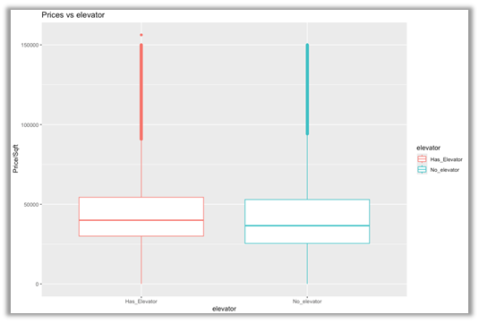
  
<em>Price vs. Elevator.</em>

#### Subway  
Homes near subway stations → higher average prices.

  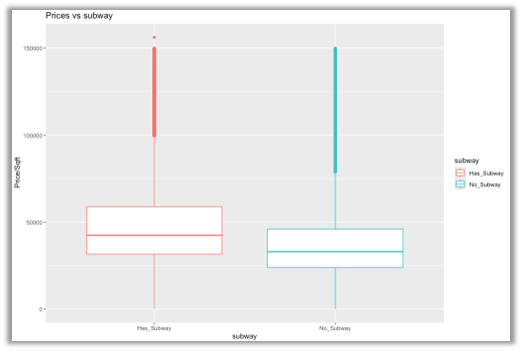
  
<em>Price vs. Subway Access.</em>

---

### 🔍 Scatterplots

#### Price vs Total Price (by building type & structure)

  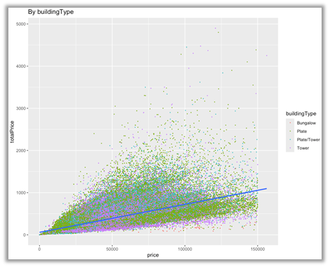
  
<em>Price vs total price by building type.</em>

  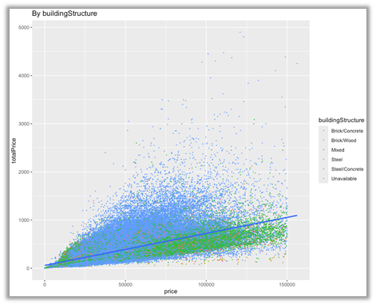
  
<em>Price vs total price by building structure.</em>

#### Group-based Regression Slopes

  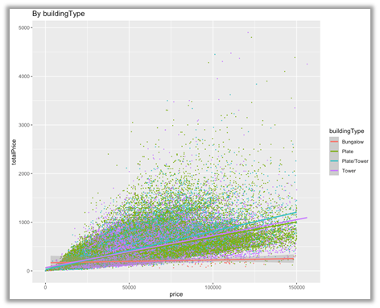
  
<em>Square vs Price — grouped by building type.</em>

  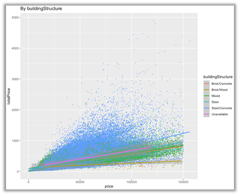
  
<em>Square vs Price — grouped by building structure.</em>

---

### 📅 Average Housing Price by Month

Shows seasonal patterns & monthly variation in housing prices.

  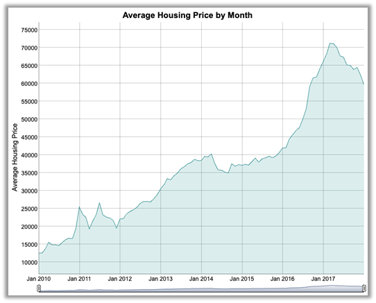
  
<em>Monthly average housing prices.</em>

---

### 🧪 Hypothesis Testing

#### **Question 1:**  
Is the sample mean of housing prices equal to 43,549.6?

Result: **Fail to reject H₀**  
➡ Price is statistically similar to the given value.

  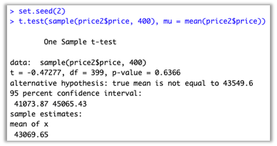

---

#### **Question 2:**  
Is there a difference in price between **Bungalows** vs **Towers**?

Result: **Reject H₀**  
➡ Bungalows significantly more expensive.

  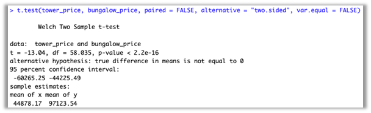

---

#### **Question 3:**  
Are 2016 prices greater than 2017 prices?

Result: **Reject H₁**  
➡ 2017 prices are significantly higher.

  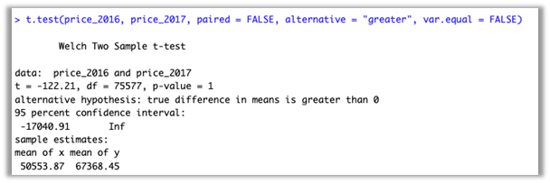

---

### 🧠 Key Insights

- Housing prices in Beijing are strongly influenced by **square meters**, **community average price**, and **building structure**.  
- Homes near subways or with elevators have higher valuations.  
- Bungalows are the most expensive housing type.  
- Prices increased **significantly** from 2016 → 2017.  
- All hypotheses were validated through t-tests (one-sample and two-sample).

---

### 🧠 Skills Demonstrated
- Data wrangling and cleaning in R  
- Visualization with ggplot2 and corrplot  
- Statistical hypothesis testing (one-sample, two-sample t-tests)  
- Interpretation of descriptive and inferential statistics  
- Exploratory data analysis workflows  

